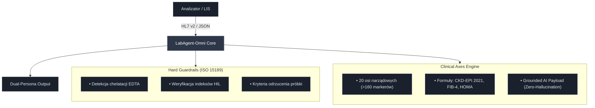
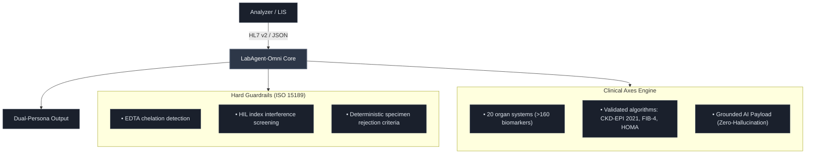

# ⚡ LabAgent-Omni Core

[](https://github.com/MatthewJakubowski/labagent-omni-core/actions/workflows/ci.yml)
[](LICENSE)
[](#)
[](#)
[](#)

> **Stateless Clinical Intelligence Wrapper & Autovalidation Sidecar Engine**  
> Przekształca surowe wyniki badań laboratoryjnych w audytowalną, dynamiczną inteligencję kliniczną. Zapewnia pełną zgodność z ISO 15189:2023, kodyfikacją LOINC, standardem HL7 FHIR R4 oraz wymogami EU AI Act (Human-in-the-loop).

---

## 🏛️ Architektura Systemu (Zero-Footprint Sidecar)

System funkcjonuje jako bezstanowy mikroserwis (stateless engine) działający w pamięci RAM, nie ingerując w bazy danych i architekturę legacy laboratoryjnych systemów informatycznych (LIS/HIS):


---

```text
Analizator / LIS ──(HL7 v2 / JSON)──► [ LabAgent-Omni Core ] ──► Dual-Persona Output
                                             │
               ┌─────────────────────────────┴─────────────────────────────┐
               ▼                                                           ▼
┌──────────────────────────────┐                           ┌──────────────────────────────┐
│  Hard Guardrails (ISO 15189) │                           │     Clinical Axes Engine     │
├──────────────────────────────┤                           ├──────────────────────────────┤
│ • Detekcja chelatacji EDTA   │                           │ • 20 osi narządowych         │
│ • Weryfikacja indeksów HIL   │                           │   (>160 markerów)            │
│ • Kryteria odrzucenia próbki │                           │ • Formuły: CKD-EPI 2021,     │
│                              │                           │   FIB-4, HOMA                │
│                              │                           │ • Grounded AI Payload        │
│                              │                           │   (Zero-Hallucination)       │
└──────────────────────────────┘                           └──────────────────────────────┘
```



---

## ⚖️ Żelazne Klauzule Prawne & Status Regulacyjny (Regulatory Shield)

### 1. Status Naukowo-Badawczy (Proof-of-Concept)
Projekt **LabAgent-Omni Core** stanowi eksperymentalne oprogramowanie demonstracyjne typu **Proof-of-Concept (PoC)** i na obecnym etapie **NIE STANOWI** certyfikowanego wyrobu medycznego do diagnostyki in vitro w rozumieniu Rozporządzenia Parlamentu Europejskiego i Rady (UE) 2017/746 (IVDR) ani wyrobu medycznego wg Rozporządzenia (UE) 2017/745 (MDR).

### 2. Ustawa o Medycynie Laboratoryjnej (Dz.U. 2022 poz. 2280)
Zgodnie z polskim porządkiem prawnym:
* Oprogramowanie **nie dokonuje samodzielnej autoryzacji wyników badań laboratoryjnych**.
* Zgodnie z art. 5 i art. 27 Ustawy z dnia 15 września 2022 r. o medycynie laboratoryjnej, wyłączne prawo do autoryzacji wyników badań diagnostycznych posiada **uprawniony diagnosta laboratoryjny**.

### 3. Odpowiedzialność Kliniczna Lekarza
* Wszelkie interpretacje wieloosiowe, wyliczenia biostatystyczne i formatki SBAR pełnią wyłącznie rolę systemów wspomagania decyzji klinicznych (**Clinical Decision Support - CDS**).
* Zgodnie z Ustawą o zawodach lekarza i lekarza dentysty ostateczną decyzję diagnostyczną i terapeutyczną podejmuje wyłącznie **lekarz prowadzący**.

### 4. Zgodność z Rozporządzeniem EU AI Act (2024/1689)
* **Zasada Human-in-the-Loop (HITL):** Algorytmy deterministyczne i moduły syntezy językowej podlegają bezwzględnemu nadzorowi człowieka.
* **Explainable AI (XAI):** Całkowita przejrzystość reguł wnioskowania – brak nieprzejrzystych modeli typu black-box w krytycznych ścieżkach decyzyjnych.
* **Grounded AI (Zero-Hallucination):** Warstwa generatywna operuje wyłącznie na twardych, zweryfikowanych faktach laboratoryjnych (Ground Truth).

### 5. Dobre Praktyki Kliniczne (ICH GCP) & Ochrona Danych (GDPR/RODO)
* Silnik w architekturze produkcyjnej operuje w modelu **Zero-Data Retention (ZDR)**.
* Identyfikatory pacjentów są haszowane kryptograficznie (SHA-256), a żadne dane osobowe ani dane wrażliwe nie są utrwalane w pamięci trwałej.

---

## 🧪 Pokrycie Diagnostyczne (20 Osi Narządowych)

1. **Hematologia & Szpik:** Morfologia 5-DIFF, Retikulocyty (RET#, RET%, RET-He), wskaźnik NLR, OB.
2. **Równowaga Kwasowo-Zasadowa:** Gazometria pełna (pH, pCO2, pO2, HCO3, BE), Mleczany.
3. **Metabolizm & Insulina:** Glikemia, Insulina, HOMA-IR, QUICKI, HbA1c, C-peptyd.
4. **Profil Lipidowy & Aterogenność:** Pełny lipidogram, ApoB, Lipoproteina(a) [Lp(a)], stosunek TG/HDL.
5. **Kardiologia CITO:** hs-Troponina T, NT-proBNP, CK-MB mass.
6. **Koagulologia & Trombofilia:** INR, APTT, D-Dimer, Antytrombina III, Białko C, Białko S, Antykoagulant toczniowy (LA).
7. **Wątroba & Cytoprotekcja:** ALT, AST, de Ritis, ALP, GGTP, Bilirubina, FIB-4.
8. **Przewód Pokarmowy & Trzustka:** Lipaza, Amylaza w surowicy i moczu, Kalprotektyna w kale, FIT.
9. **Nerki & Filtracja:** Kreatynina, Cystatyna C, eGFR wg CKD-EPI 2021, Mocznik, Kwas moczowy.
10. **Gospodarka Żelazem & Białka:** Żelazo, UIBC/TIBC, Wysycenie transferyny TSAT%, Ferrytyna, Haptoglobina, Ceruloplazmina.
11. **Zapalenie & Dopełniacz:** hs-CRP, Prokalcytonina (PCT), Dopełniacz C3 i C4, Homocysteina.
12. **Witaminy & Metylacja:** 25(OH)D3, Witamina B12, Kwas foliowy.
13. **Endokrynologia Tarczycy & Przytarczyc:** TSH, FT4, FT3, Indeks konwersji, Parathormon nienaruszony (iPTH).
14. **Przysadka & Steroidy Płciowe:** Testosteron, SHBG, FAI, LH, FSH, Prolaktyna, DHEA-SO4, IGF-1.
15. **Autoimmunologia Specjalistyczna:** anty-TPO, anty-TG, TRAb, anty-CCP (odcięcia ACR/EULAR), RF IgM, ANA1, c-ANCA, p-ANCA.
16. **Odpowiedź Humoralna & Atopia:** IgG, IgA, IgM, IgE Total.
17. **Onkomarkery Narządowe:** PSA całkowity, fPSA (wskaźnik fPSA/PSA), CEA, CA 125, CA 15-3, CA 19-9, AFP, Chromogranina A, Beta-2-Mikroglobulina.
18. **Serologia Zakaźna & TORCH:** HBsAg, anty-HBc Total, anty-HBs (miano), anty-HCV, HIV Combo, Kiła (TP), Toxoplazmoza, CMV, Różyczka (Rubella), Borelioza (IgM/IgG), EBV.
19. **Toksykologia Kliniczna & TDM:** Digoksyna, Paracetamol, Etanol.
20. **Mocz Ogólny & Osad:** Ciężar właściwy, pH, białko, glukoza, ketony, osad mikroskopowy.

---

## 🚀 Uruchomienie Lokalne

```bash
# Sklonuj repozytorium
git clone [https://github.com/MatthewJakubowski/labagent-omni-core.git](https://github.com/MatthewJakubowski/labagent-omni-core.git)
cd labagent-omni-core

# Zainstaluj zależności
pip install -r requirements.txt

# Uruchom testy jednostkowe
pytest tests/ -v

# Uruchom aplikację demonstracyjną
streamlit run app.py
```
## 📄 Licencja

[](https://opensource.org/licenses/MIT)

Projekt jest dystrybuowany na licencji **MIT License**. Szczegółowe informacje znajdują się w pliku [`LICENSE`](./LICENSE).


---

# ⚡ LabAgent-Omni Core (English Version)

[](https://github.com/MatthewJakubowski/labagent-omni-core/actions/workflows/ci.yml)
[](LICENSE)
[](#)
[](#)
[](#)

> **Stateless Clinical Intelligence Wrapper & Autovalidation Sidecar Engine**  
> Transforms raw laboratory outputs into fully auditable, dynamic clinical intelligence. Operates with strict adherence to ISO 15189:2023 quality standards, LOINC ontology, HL7 FHIR R4 interoperability protocols, and EU AI Act Human-in-the-Loop requirements.

---

## 🏛️ System Architecture (Zero-Footprint Sidecar)

The system operates as an ultra-lightweight, stateless in-memory execution engine that runs alongside legacy Laboratory Information Systems (LIS) and Hospital Information Systems (HIS) without requiring schema alterations or workflow disruption:

```text
Analyzer / LIS ──(HL7 v2 / JSON)──► [ LabAgent-Omni Core ] ──► Dual-Persona Output
                                             │
               ┌─────────────────────────────┴─────────────────────────────┐
               ▼                                                           ▼
┌──────────────────────────────┐                           ┌──────────────────────────────┐
│  Hard Guardrails (ISO 15189) │                           │     Clinical Axes Engine     │
├──────────────────────────────┤                           ├──────────────────────────────┤
│ • EDTA chelation detection   │                           │ • 20 organ/clinical axes     │
│ • HIL index verification     │                           │   (>160 biomarkers)          │
│ • Hard specimen reject rules │                           │ • Equations: CKD-EPI 2021,   │
│                              │                           │   FIB-4, HOMA, QUICKI        │
│                              │                           │ • Grounded AI Payload        │
│                              │                           │   (Strict Zero-Hallucination)│
└──────────────────────────────┘                           └──────────────────────────────┘
```

## ⚖️ Legal Framework, Regulatory Shield & Governance

> [!WARNING]
> **Research & Proof-of-Concept Status (IVDR / MDR Disclaimer)**  
> **LabAgent-Omni Core** is an experimental demonstration platform and Proof-of-Concept (PoC) intended exclusively for research and development purposes. At this stage, it is **NOT** a certified In Vitro Diagnostic Medical Device (IVD) under **Regulation (EU) 2017/746 (IVDR)**, nor a Medical Device under **Regulation (EU) 2017/745 (MDR)**. It must **not** be deployed for autonomous diagnostic conclusions or clinical routine without authorized medical oversight.

---

### 1. Statutory Authority of Laboratory Diagnosticians
Pursuant to statutory requirements governing laboratory medicine (including the Polish Laboratory Medicine Act of September 15, 2022, *Dz.U. 2022 item 2280, arts. 5 & 27*):
* **No Autonomous Release:** The engine does not perform autonomous, final result authorization or medical validation.
* **Exclusive Competence:** The statutory and legal authority for medical laboratory diagnostic verification, clinical interpretation, and sign-off remains strictly with a certified, licensed **Medical Laboratory Diagnostician / Clinical Scientist**.

### 2. Physician Decision Authority (Clinical Decision Support)
* All cross-axis correlations, statistical trajectories, and structured **SBAR** (Situation-Background-Assessment-Recommendation) summaries function strictly as **Clinical Decision Support (CDS)** artifacts.
* Under national medical practice acts, ultimate diagnostic categorization, differential evaluation, and therapeutic intervention remain the exclusive purview and legal responsibility of the attending licensed physician.

### 3. EU Artificial Intelligence Act Compliance (EU AI Act 2024/1689)
* **Human-in-the-Loop (HITL):** Deterministic engines, rule-based checks, and downstream language synthesis pipelines enforce mandatory human oversight at all clinical junction points.
* **Explainable AI (XAI):** Full architectural transparency — inference logic relies exclusively on fully auditable mathematical models, validated equations, and standard-of-care medical consensus rather than unverified black-box systems.
* **Grounded AI (Zero-Hallucination Architecture):** Generative interpretation layers consume strictly pre-validated, deterministic biological ground truth generated by the verification core.

### 4. Good Clinical Practice (ICH GCP) & Data Sovereignty (GDPR)
* **Zero-Data Retention (ZDR):** Operates on a transient execution paradigm; no clinical payload persists across runtime cycles.
* **Cryptographic Anonymization:** Direct identifiers are transformed into irreversibly salted hashes (**SHA-256**). No Protected Health Information (PHI) or Special Category Personal Data (GDPR Art. 9) is committed to persistent databases or secondary storage layers.

---

## 🧪 Comprehensive Diagnostic Scope (20 Clinical Axes)

The deterministic reasoning core evaluates quantitative and qualitative laboratory data across **20 organ-specific and metabolic clinical axes** (>160 bio-markers):

| # | Clinical Axis | Biomarkers, Indices & Deterministic Panels |
|:---:|:---|:---|
| **01** | **Hematology & Bone Marrow Dynamics** | 5-Part Differential CBC, Absolute & Relative Reticulocytes (`RET#`, `RET%`, `IRF`), Reticulocyte Hemoglobin (`RET-He`), `NLR` ratio, ESR (*Westergren*) |
| **02** | **Acid-Base Homeostasis & Gasometry** | Whole-blood Blood Gas (`pH`, `pCO2`, `pO2`, `HCO3-act`, `Base Excess`, `sO2`), Plasma Lactate |
| **03** | **Carbohydrate Metabolism & Insulin Sensitivity** | Fasting Glucose, Fasting Insulin, `HOMA-IR`, `QUICKI` index, `HbA1c`, C-Peptide |
| **04** | **Advanced Lipidology & Atherogenicity** | Complete Lipid Panel (`TC`, `HDL`, `LDL-C`, `non-HDL`, `TG`), Apolipoprotein B (`ApoB`), Lipoprotein(a) [`Lp(a)`] , `TG/HDL` ratio |
| **05** | **Critical Cardiology** | High-sensitivity Troponin T (`hs-cTnT`), `NT-proBNP`, `CK-MB` mass |
| **06** | **Hemostasis & Thrombophilia Screening** | `PT/INR`, `APTT`, Fibrinogen, `D-Dimer`, Antithrombin III, Protein C, Protein S, Lupus Anticoagulant (`LA1/LA2`) |
| **07** | **Hepatobiliary Cytoprotection** | `ALT`, `AST`, de Ritis ratio (`AST/ALT`), Alkaline Phosphatase (`ALP`), `GGTP`, Total & Direct Bilirubin, `FIB-4` Fibrosis Score |
| **08** | **Gastroenterology & Pancreatic Function** | Serum Lipase, Serum Amylase, Urine Diastase, Fecal Calprotectin, Fecal Immunochemical Test (`FIT/FOBT`) |
| **09** | **Renal Function & Mineral Excretion** | Serum Creatinine, Serum Cystatin C, eGFR via `CKD-EPI 2021` (race-neutral), Urea, Uric Acid |
| **10** | **Iron Kinetics & Plasma Proteins** | Serum Iron, `UIBC`, `TIBC`, Transferrin Saturation (`TSAT%`), Serum Ferritin, Haptoglobin, Ceruloplasmin |
| **11** | **Inflammatory Dynamics & Complement** | High-sensitivity CRP (`hs-CRP`), Procalcitonin (`PCT`), Complement Components `C3` & `C4`, Plasma Homocysteine |
| **12** | **Micronutrients & Methylation** | `25(OH) Vitamin D3`, Vitamin B12 (*Cobalamin*), Serum Folate |
| **13** | **Thyroid & Parathyroid Endocrinology** | `TSH`, Free T4 (`FT4`), Free T3 (`FT3`), Peripheral Conversion Ratio (`FT3/FT4`), Intact Parathyroid Hormone (`iPTH`) |
| **14** | **Pituitary & Reproductive Steroid Axis** | Total Testosterone, Free Androgen Index (`FAI`), `SHBG`, `LH`, `FSH`, Prolactin, `DHEA-SO4`, Somatomedin C (`IGF-1`) |
| **15** | **Autoimmunity & Rheumatology** | `Anti-TPO`, `Anti-TG`, `TRAb`, `Anti-CCP` (*ACR/EULAR* criteria), `RF IgM`, `ANA1` (*HEp-2* screening), ANCA profile (`c-ANCA/PR3`, `p-ANCA/MPO`) |
| **16** | **Humoral Immune Response & Atopy** | Quantitative Immunoglobulins (`IgG`, `IgA`, `IgM`), Total `IgE` |
| **17** | **Organ-Specific Tumor Markers** | Total `PSA`, Free PSA (`fPSA/PSA` ratio), `CEA`, `CA 125`, `CA 15-3`, `CA 19-9`, Alpha-Fetoprotein (`AFP`), Chromogranin A (`CgA`), $\beta_2$-Microglobulin |
| **18** | **Infectious Disease Serology & TORCH** | `HBsAg`, `Anti-HBc Total`, `Anti-HBs` titer, `Anti-HCV`, HIV Combo (`Ag p24 + Ab`), Syphilis (`TP/RPR`), *Toxoplasma gondii* (`IgG/IgM`), *CMV* (`IgG/IgM`), *Rubella* (`IgG/IgM`), *Borrelia burgdorferi* (`IgM/IgG`), `EBV VCA` |
| **19** | **Toxicology & TDM** | Digoxin, Serum Paracetamol, Serum Ethanol |
| **20** | **Automated Urinalysis & Microscopy** | Specific Gravity, `pH`, Protein, Glucose, Ketones, Urobilinogen, Automated Sediment Examination (`RBC`, `WBC`, Casts/Hyaline/Pathological) |

## 🚀 Local Deployment & Quickstart
```bash
# Clone the repository
git clone [https://github.com/MatthewJakubowski/labagent-omni-core.git](https://github.com/MatthewJakubowski/labagent-omni-core.git)
cd labagent-omni-core

# Install deterministic dependencies
pip install -r requirements.txt

# Execute automated clinical validation suite
python -m pytest tests/ -v

# Launch the interactive demonstration interface
streamlit run app.py
```
## 📄 License

[](https://opensource.org/licenses/MIT)

Distributed under the **MIT License**. See [`LICENSE`](./LICENSE) for full legal terms.
