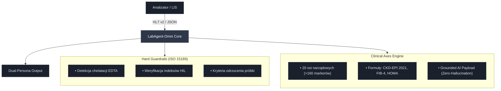
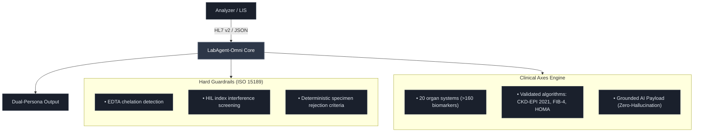

# ⚡ LabAgent-Omni Core

[](https://github.com/MatthewJakubowski/labagent-omni-core/actions/workflows/ci.yml)
[](https://labagent-omni-core.streamlit.app)
[](LICENSE)
[](#)
[](#)
[](#)

> **Stateless Clinical Intelligence Wrapper & Autovalidation Sidecar Engine**  
> Przekształca surowe wyniki badań laboratoryjnych w audytowalną, dynamiczną inteligencję kliniczną. Zapewnia pełną zgodność z ISO 15189:2023, kodyfikacją LOINC, standardem HL7 FHIR R4 oraz wymogami EU AI Act (Human-in-the-loop).

🔗 **Live Showcase:** [https://labagent-omni-core.streamlit.app](https://labagent-omni-core.streamlit.app)  
🌐 **Dossier Twórcy:** [https://mateusz-jakubowski.ai.studio](https://mateusz-jakubowski.ai.studio)

---

## 🏛️ Architektura Systemu (Zero-Footprint Sidecar)

System funkcjonuje jako bezstanowy mikroserwis (stateless engine) działający w pamięci RAM, nie ingerując w bazy danych i architekturę legacy laboratoryjnych systemów informatycznych (LIS/HIS):

```text
Analizator / LIS ──(HL7 v2 / JSON)──► [ LabAgent-Omni Core ] ──► Dual-Persona Output
                                             │
               ┌─────────────────────────────┴─────────────────────────────┐
               ▼                                                           ▼
┌──────────────────────────────┐                           ┌──────────────────────────────┐
│  Hard Guardrails (ISO 15189) │                           │     Clinical Axes Engine     │
├──────────────────────────────┤                           ├──────────────────────────────┤
│ • Detekcja chelatacji EDTA   │                           │ • 20 osi narządowych         │
│ • Weryfikacja indeksów HIL   │                           │   (>160 markerów)            │
│ • Kryteria odrzucenia próbki │                           │ • Formuły: CKD-EPI 2021,     │
│                              │                           │   FIB-4, HOMA                │
│                              │                           │ • Grounded AI Payload        │
│                              │                           │   (Zero-Hallucination)       │
└──────────────────────────────┘                           └──────────────────────────────┘
```

---

## ⚖️ Żelazne Klauzule Prawne & Status Regulacyjny (Regulatory Shield)

> [!WARNING]
> **Status Naukowo-Badawczy (Proof-of-Concept)**  
> Projekt `LabAgent-Omni Core` stanowi eksperymentalne oprogramowanie demonstracyjne typu Proof-of-Concept (PoC) i na obecnym etapie **NIE STANOWI** certyfikowanego wyrobu medycznego do diagnostyki in vitro w rozumieniu Rozporządzenia Parlamentu Europejskiego i Rady (UE) 2017/746 (**IVDR**) ani wyrobu medycznego wg Rozporządzenia (UE) 2017/745 (**MDR**).

* **Ustawa o Medycynie Laboratoryjnej (Dz.U. 2022 poz. 2280):**
  * Oprogramowanie **nie dokonuje** samodzielnej autoryzacji wyników badań laboratoryjnych.
  * Zgodnie z **art. 5 i art. 27** Ustawy z dnia 15 września 2022 r. o medycynie laboratoryjnej, wyłączne prawo do autoryzacji wyników badań diagnostycznych posiada uprawniony diagnosta laboratoryjny.
* **Odpowiedzialność Kliniczna Lekarza:**
  * Wszelkie interpretacje wieloosiowe, wyliczenia biostatystyczne i formatki SBAR pełnią wyłącznie rolę systemów wspomagania decyzji klinicznych (**Clinical Decision Support – CDS**).
  * Zgodnie z *Ustawą o zawodach lekarza i lekarza dentysty* ostateczną decyzję diagnostyczną i terapeutyczną podejmuje wyłącznie lekarz prowadzący.
* **Zgodność z Rozporządzeniem EU AI Act (2024/1689):**
  * **Human-in-the-Loop (HITL):** Algorytmy deterministyczne i moduły syntezy językowej podlegają bezwzględnemu nadzorowi człowieka.
  * **Explainable AI (XAI):** Całkowita przejrzystość reguł wnioskowania – brak nieprzejrzystych modeli typu *black-box* w krytycznych ścieżkach decyzyjnych.
  * **Grounded AI (Zero-Hallucination):** Warstwa generatywna operuje wyłącznie na twardych, zweryfikowanych faktach laboratoryjnych (*Ground Truth*).
* **Dobre Praktyki Kliniczne (ICH GCP) & Ochrona Danych (GDPR/RODO):**
  * Silnik w architekturze produkcyjnej operuje w modelu **Zero-Data Retention (ZDR)**.
  * Identyfikatory pacjentów są haszowane kryptograficznie (`SHA-256`), a żadne dane osobowe ani wrażliwe nie są utrwalane w pamięci trwałej.

---

## 📡 Specyfikacja Endpointów API (FastAPI Sidecar)

Bezstanowy mikroserwis udostępnia interfejs REST dla szyny danych LIS/HIS:

| Metoda | Endpoint | Opis |
| :--- | :--- | :--- |
| `GET` | `/health` | Status żywotności silnika. |
| `POST` | `/api/v1/audit` | Deterministyczny audyt przedanalityczny i wieloosiowy. |
| `POST` | `/api/v1/fhir-bundle` | Natywny eksport do standardu HL7 FHIR R4 Transaction Bundle. |
| `POST` | `/api/v1/synthesize` | Generowanie syntezy SBAR oraz widoku pacjenta w oparciu o Grounded AI. |

---

## 🧪 Pokrycie Diagnostyczne (20 Osi Narządowych)

<details open>
<summary><b>Kliknij, aby rozwinąć / zwinąć pełną listę parametrów</b></summary>

| Oś diagnostyczna | Monitorowane parametry i wskaźniki |
| :--- | :--- |
| **Hematologia & Szpik** | Morfologia 5-DIFF, Retikulocyty (`RET#`, `RET%`, `RET-He`), wskaźnik NLR, OB |
| **Równowaga Kwasowo-Zasadowa** | Gazometria pełna (`pH`, `pCO2`, `pO2`, `HCO3`, `BE`), Mleczany |
| **Metabolizm & Insulina** | Glikemia, Insulina, HOMA-IR, QUICKI, HbA1c, C-peptyd |
| **Profil Lipidowy & Aterogenność** | Pełny lipidogram, ApoB, Lipoproteina(a) `Lp(a)`, stosunek TG/HDL |
| **Kardiologia CITO** | hs-Troponina T, NT-proBNP, CK-MB mass |
| **Koagulologia & Trombofilia** | INR, APTT, D-Dimer, Antytrombina III, Białko C, Białko S, Antykoagulant toczniowy (LA) |
| **Wątroba & Cytoprotekcja** | ALT, AST, wskaźnik de Ritisa, ALP, GGTP, Bilirubina, FIB-4 |
| **Przewód Pokarmowy & Trzustka** | Lipaza, Amylaza w surowicy i moczu, Kalprotektyna w kale, FIT |
| **Nerki & Filtracja** | Kreatynina, Cystatyna C, eGFR wg CKD-EPI 2021, Mocznik, Kwas moczowy |
| **Gospodarka Żelazem & Białka** | Żelazo, UIBC/TIBC, Wysycenie transferyny `TSAT%`, Ferrytyna, Haptoglobina, Ceruloplazmina |
| **Zapalenie & Dopełniacz** | hs-CRP, Prokalcytonina (PCT), Dopełniacz C3 i C4, Homocysteina |
| **Witaminy & Metylacja** | 25(OH)D3, Witamina B12, Kwas foliowy |
| **Endokrynologia Tarczycy & Przytarczyc** | TSH, FT4, FT3, Indeks konwersji, Parathormon nienaruszony (iPTH) |
| **Przysadka & Steroidy Płciowe** | Testosteron, SHBG, FAI, LH, FSH, Prolaktyna, DHEA-SO4, IGF-1 |
| **Autoimmunologia Specjalistyczna** | anty-TPO, anty-TG, TRAb, anty-CCP (odcięcia ACR/EULAR), RF IgM, ANA1, c-ANCA, p-ANCA |
| **Odpowiedź Humoralna & Atopia** | IgG, IgA, IgM, IgE Total |
| **Onkomarkery Narządowe** | PSA całkowity, fPSA (wskaźnik fPSA/PSA), CEA, CA 125, CA 15-3, CA 19-9, AFP, Chromogranina A, Beta-2-Mikroglobulina |
| **Serologia Zakaźna & TORCH** | HBsAg, anty-HBc Total, anty-HBs (miano), anty-HCV, HIV Combo, Kiła (TP), Toksoplazmoza, CMV, Różyczka (Rubella), Borelioza (IgM/IgG), EBV |
| **Toksykologia Kliniczna & TDM** | Digoksyna, Paracetamol, Etanol |
| **Mocz Ogólny & Osad** | Ciężar właściwy, pH, białko, glukoza, ketony, osad mikroskopowy |

</details>

---

## 🚀 Uruchomienie Lokalne

```bash
# Sklonuj repozytorium
git clone [https://github.com/MatthewJakubowski/labagent-omni-core.git](https://github.com/MatthewJakubowski/labagent-omni-core.git)
cd labagent-omni-core

# Zainstaluj zależności
pip install -r requirements.txt

# Uruchom automatyczne testy jednostkowe
python -m pytest tests/ -v

# Uruchom interaktywny interfejs demonstracyjny
streamlit run app.py

# Uruchom mikroserwis produkcyjny FastAPI
uvicorn api.main:app --reload --port 8000
```

# ⚡ LabAgent-Omni Core

**Stateless Clinical Intelligence Wrapper & Autovalidation Sidecar Engine**

Transforms raw laboratory outputs into fully auditable, dynamic clinical intelligence. Operates with strict adherence to **ISO 15189:2023** quality standards, **LOINC** ontology, **HL7 FHIR R4** interoperability protocols, and **EU AI Act** Human-in-the-Loop requirements.

<p align="left">
  <a href="https://labagent-omni-core.streamlit.app"></a>
  <a href="https://mateusz-jakubowski.ai.studio"></a>
  
</p>

* 🔗 **Live Demo:** [labagent-omni-core.streamlit.app](https://labagent-omni-core.streamlit.app)
* 🌐 **Author Dossier:** [mateusz-jakubowski.ai.studio](https://mateusz-jakubowski.ai.studio)

---

## 🏛️ System Architecture (Zero-Footprint Sidecar)

The system operates as an ultra-lightweight, stateless **in-memory execution engine** designed to run alongside legacy Laboratory Information Systems (**LIS**) and Hospital Information Systems (**HIS**) without requiring database schema alterations or clinical workflow disruptions.

```text
Analyzer / LIS ──(HL7 v2 / JSON)──► [ LabAgent-Omni Core ] ──► Dual-Persona Output
                                             │
               ┌─────────────────────────────┴─────────────────────────────┐
               ▼                                                           ▼
┌──────────────────────────────┐                           ┌──────────────────────────────┐
│  Hard Guardrails (ISO 15189) │                           │     Clinical Axes Engine     │
├──────────────────────────────┤                           ├──────────────────────────────┤
│ • EDTA chelation detection   │                           │ • 20 organ/clinical axes     │
│ • HIL index verification     │                           │   (>160 biomarkers)          │
│ • Hard specimen reject rules │                           │ • Equations: CKD-EPI 2021,   │
│                              │                           │   FIB-4, HOMA, QUICKI        │
│                              │                           │ • Grounded AI Payload        │
│                              │                           │   (Strict Zero-Hallucination)│
└──────────────────────────────┘                           └──────────────────────────────┘
```

---
---

## ⚖️ Legal Framework, Regulatory Shield & Governance

> [!WARNING]
> **Research & Proof-of-Concept Status (IVDR / MDR Disclaimer)**  
> `LabAgent-Omni Core` is an experimental demonstration platform and Proof-of-Concept (PoC) intended exclusively for research and development purposes. At this stage, it is **NOT** a certified In Vitro Diagnostic Medical Device (IVD) under Regulation (EU) 2017/746 (**IVDR**), nor a Medical Device under Regulation (EU) 2017/745 (**MDR**). It must not be deployed for autonomous diagnostic conclusions or clinical routine without authorized medical oversight.

* **Statutory Authority of Laboratory Diagnosticians:**
  * **No Autonomous Release:** The engine does not perform autonomous, final result authorization or medical validation.
  * **Exclusive Competence:** Pursuant to statutory requirements governing laboratory medicine (including the Polish *Laboratory Medicine Act* of September 15, 2022, Dz.U. 2022 item 2280, arts. 5 & 27), the statutory and legal authority for medical laboratory diagnostic verification, clinical interpretation, and sign-off remains strictly with a certified, licensed **Medical Laboratory Diagnostician / Clinical Scientist**.
* **Physician Decision Authority (Clinical Decision Support):**
  * All cross-axis correlations, statistical trajectories, and structured SBAR (*Situation-Background-Assessment-Recommendation*) summaries function strictly as **Clinical Decision Support (CDS)** artifacts.
  * Under national medical practice acts, ultimate diagnostic categorization, differential evaluation, and therapeutic intervention remain the exclusive purview and legal responsibility of the attending licensed physician.
* **EU Artificial Intelligence Act Compliance (EU AI Act 2024/1689):**
  * **Human-in-the-Loop (HITL):** Deterministic engines, rule-based checks, and downstream language synthesis pipelines enforce mandatory human oversight at all clinical junction points.
  * **Explainable AI (XAI):** Full architectural transparency — inference logic relies exclusively on fully auditable mathematical models, validated equations, and standard-of-care medical consensus rather than unverified *black-box* systems.
  * **Grounded AI (Zero-Hallucination Architecture):** Generative interpretation layers consume strictly pre-validated, deterministic biological ground truth generated by the verification core.
* **Good Clinical Practice (ICH GCP) & Data Sovereignty (GDPR):**
  * **Zero-Data Retention (ZDR):** Operates on a transient execution paradigm; no clinical payload persists across runtime cycles.
  * **Cryptographic Anonymization:** Direct identifiers are transformed into irreversibly salted hashes (`SHA-256`). No Protected Health Information (PHI) or Special Category Personal Data (*GDPR Art. 9*) is committed to persistent databases or secondary storage layers.

---

## 📡 API Endpoint Architecture (FastAPI Sidecar)

The sidecar exposes stateless REST endpoints designed for enterprise hospital data-bus and LIS/HIS integration:

| Method | Endpoint | Description |
| :--- | :--- | :--- |
| `GET` | `/health` | Engine health check, uptime, and operational status. |
| `POST` | `/api/v1/audit` | Deterministic preanalytical gating and multi-axis verification run. |
| `POST` | `/api/v1/fhir-bundle` | Converts verified run into an **HL7 FHIR R4 Transaction Bundle**. |
| `POST` | `/api/v1/synthesize` | Generates clinical SBAR and patient summaries via grounded synthesis. |

---

## 🧪 Comprehensive Diagnostic Scope (20 Clinical Axes)

The deterministic reasoning core evaluates quantitative and qualitative laboratory data across 20 organ-specific and metabolic clinical axes (>160 individual biomarkers):

<details open>
<summary><b>Click to expand / collapse full clinical scope</b></summary>

| Organ / Metabolic Axis | Key Monitored Biomarkers & Derived Metrics |
| :--- | :--- |
| **Hematology & Bone Marrow** | 5-Part Differential CBC, Reticulocytes (`RET#`, `RET%`, `RET-He`), NLR ratio, ESR |
| **Acid-Base & Blood Gas** | Complete Arterial/Venous Blood Gas (`pH`, `pCO2`, `pO2`, `HCO3-`, `BE`), Lactate |
| **Metabolism & Glycemia** | Fasting Glucose, Insulin, HOMA-IR, QUICKI, HbA1c, C-Peptide |
| **Lipid Profile & Atherogenicity** | Full Lipid Panel, Apolipoprotein B (`ApoB`), Lipoprotein(a) `Lp(a)`, TG/HDL-C ratio |
| **STAT Cardiology** | High-Sensitivity Troponin T (`hs-cTnT`), NT-proBNP, CK-MB mass |
| **Coagulation & Thrombophilia** | PT/INR, aPTT, D-Dimer, Antithrombin III, Protein C, Protein S, Lupus Anticoagulant (LA) |
| **Hepatic & Cytoprotection** | ALT, AST, De Ritis Ratio (`AST/ALT`), ALP, GGT, Total/Direct Bilirubin, FIB-4 Index |
| **Gastroenterology & Pancreas** | Lipase, Serum & Urine Amylase, Fecal Calprotectin, Fecal Immunochemical Test (FIT) |
| **Renal Function & Filtration** | Serum Creatinine, Cystatin C, eGFR (CKD-EPI 2021), Blood Urea Nitrogen, Uric Acid |
| **Iron Dynamics & Plasma Proteins** | Serum Iron, UIBC/TIBC, Transferrin Saturation (`TSAT%`), Ferritin, Haptoglobin, Ceruloplasmin |
| **Inflammation & Complement** | High-Sensitivity CRP (`hs-CRP`), Procalcitonin (PCT), Complement C3 & C4, Homocysteine |
| **Vitamins & Methylation** | 25-Hydroxyvitamin D3 `25(OH)D3`, Vitamin B12 (Cobalamin), Serum Folate |
| **Thyroid & Parathyroid Endocrinology** | TSH, Free T4 (`FT4`), Free T3 (`FT3`), T3/T4 Conversion Ratio, Intact PTH (`iPTH`) |
| **Pituitary & Gonadal Steroids** | Total Testosterone, SHBG, Free Androgen Index (`FAI`), LH, FSH, Prolactin, DHEA-SO4, IGF-1 |
| **Advanced Autoimmunity** | Anti-TPO, Anti-TG, TRAb, Anti-CCP (ACR/EULAR cutoffs), RF IgM, ANA Screen, c-ANCA, p-ANCA |
| **Humoral Immunity & Allergy** | Quantitative Immunoglobulins (`IgG`, `IgA`, `IgM`), Total IgE |
| **Tumor Biomarkers** | Total PSA, Free PSA (`%fPSA`), CEA, CA 125, CA 15-3, CA 19-9, AFP, Chromogranin A, Beta-2-Microglobulin |
| **Infectious Serology & TORCH** | HBsAg, Anti-HBc Total, Anti-HBs titer, Anti-HCV, HIV-1/2 Combo, Syphilis TP, Toxoplasma, CMV, Rubella, Lyme IgM/IgG, EBV |
| **Clinical Toxicology & TDM** | Therapeutic Drug Monitoring: Digoxin, Acetaminophen/Paracetamol, Blood Ethanol |
| **Urinalysis & Sediment** | Specific Gravity, pH, Protein, Glucose, Ketones, Automated Microscopic Sediment |

</details>

## 🚀 Local Deployment & Quickstart
```bash
# Clone the repository
git clone [https://github.com/MatthewJakubowski/labagent-omni-core.git](https://github.com/MatthewJakubowski/labagent-omni-core.git)
cd labagent-omni-core

# Install deterministic dependencies
pip install -r requirements.txt

# Execute automated clinical validation suite
python -m pytest tests/ -v

# Launch the interactive demonstration interface
streamlit run app.py

# Launch the production FastAPI microservice
uvicorn api.main:app --reload --port 8000
```
---

## 📄 License

Distributed under the **MIT License**. See [`LICENSE`](LICENSE) for full legal terms.

```text
MIT License

Copyright (c) 2026 Mateusz Jakubowski

Permission is hereby granted, free of charge, to any person obtaining a copy
of this software and associated documentation files (the "Software"), to deal
in the Software without restriction, including without limitation the rights
to use, copy, modify, merge, publish, distribute, sublicense, and/or sell
copies of the Software, and to permit persons to whom the Software is
furnished to do so, subject to the following conditions:

The above copyright notice and this permission notice shall be included in all
copies or substantial portions of the Software.

THE SOFTWARE IS PROVIDED "AS IS", WITHOUT WARRANTY OF ANY KIND, EXPRESS OR
IMPLIED, INCLUDING BUT NOT LIMITED TO THE WARRANTIES OF MERCHANTABILITY,
FITNESS FOR A PARTICULAR PURPOSE AND NONINFRINGEMENT. IN NO EVENT SHALL THE
AUTHORS OR COPYRIGHT HOLDERS BE LIABLE FOR ANY CLAIM, DAMAGES OR OTHER
LIABILITY, WHETHER IN AN ACTION OF CONTRACT, TORT OR OTHERWISE, ARISING FROM,
OUT OF OR IN CONNECTION WITH THE SOFTWARE OR THE USE OR OTHER DEALINGS IN THE
SOFTWARE.
